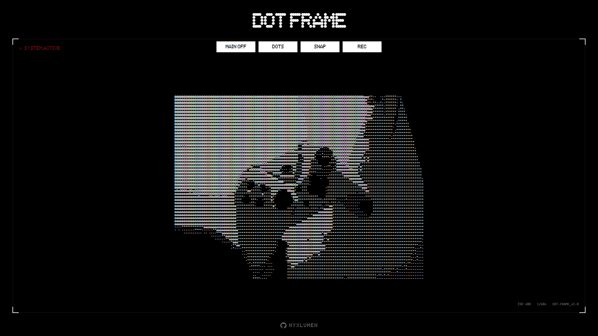
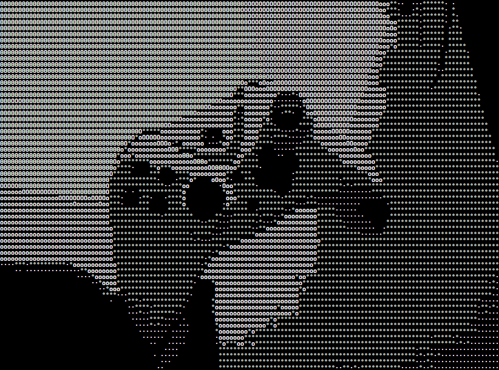
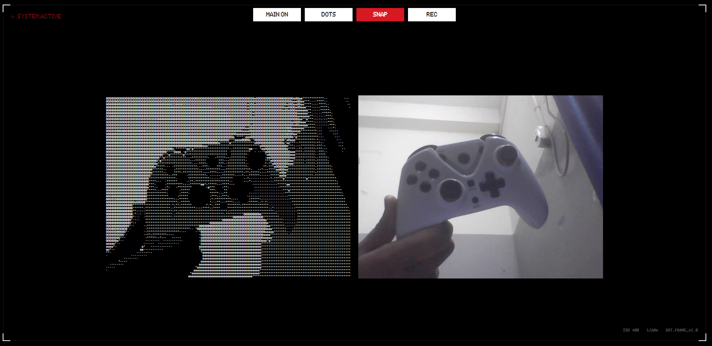

# DOT FRAME

A real-time ASCII art webcam filter that transforms your camera feed into retro-styled terminal art. A raw, zero dependency ASCII engine built on the HTML5 Canvas API.



## ✨ Features

- **Real-time ASCII Conversion**: Watch your webcam feed transform into ASCII art in real-time
- **Dual Rendering Modes**:
  - **DOTS Mode**: Classic ASCII characters (·, °, o, O, 0, @)
  - **CRT Mode**: Block characters for that retro terminal feel (░, ▒, ▓, █)
- **Snapshot Capture**: Save your ASCII art as PNG images
- **Video Recording**: Record your ASCII feed as WebM video
- **Fully Responsive**: Works seamlessly on desktop, tablet, and mobile devices
- **Retro UI**: Terminal-inspired interface with viewfinder overlay

## 🎮 Modes

### DOTS Mode



Classic ASCII art using dot and circle characters for smooth gradients.

### BLOCKS Mode


Retro terminal aesthetic with block characters for that classic scanline look.

## 📸 View With Main Camera Feed



View both the original webcam feed and ASCII conversion side-by-side.

## 🚀 Getting Started

### Prerequisites

- A modern web browser with webcam access
- Node.js and npm (for development)

### Installation

1. Clone the repository:

```bash
git clone https://github.com/NyxLumen/DotFrame.git
cd DotFrame
```

2. Install dependencies:

```bash
npm install
```

3. Start the development server:

```bash
npm run dev
```

4. Open your browser and navigate to `http://localhost:5173`

### Building for Production

```bash
npm run build
```

## 🎛️ Controls

- **MAIN OFF/ON**: Toggle the original webcam feed visibility
- **MODE**: Switch between DOTS and BLOCKS rendering modes
- **SNAP**: Capture a snapshot of the current ASCII frame
- **REC**: Start/stop video recording

## 🔧 Configuration

You can adjust the ASCII art quality by modifying these constants in `main.js`:

```javascript
const CAPTURE_WIDTH = 640; // Camera capture resolution width
const CAPTURE_HEIGHT = 480; // Camera capture resolution height
const BASE_CELL_WIDTH = 6; // Cell sampling size (lower = more detail)
```

### Performance Tips

- **For better performance**: Increase `BASE_CELL_WIDTH` (8-10) or lower capture resolution (320x240)
- **For higher quality**: Decrease `BASE_CELL_WIDTH` (3-4) or increase capture resolution (1280x720)
- **Recommended balance**: `BASE_CELL_WIDTH = 4` with `640x480` resolution

## 🛠️ Tech Stack

- **Vanilla JavaScript**: No frameworks, pure JS
- **HTML5 Canvas**: For rendering ASCII art
- **WebRTC**: For webcam access via `getUserMedia`
- **CSS3**: Responsive design with modern CSS features
- **Vite**: Fast development and build tooling

## 📁 Project Structure

```
dot-frame/
├── main.js           # Main application logic and initialization
├── index.html        # HTML structure
└── src/
    ├── Capture.js    # Webcam capture handling
    ├── Engine.js     # ASCII conversion engine
    └── style.css     # Styling and responsive design

```

## 🎨 Features in Detail

### Real-time Processing

The engine samples pixels from your webcam feed and converts them to ASCII characters based on luminance values, creating a live ASCII art stream at 60fps.

### Luminance Calculation

Uses the standard luminance formula for accurate brightness perception:

```javascript
luminance = 0.2126 * R + 0.7152 * G + 0.0722 * B;
```

### Recording

Captures the canvas stream at 60fps with VP9 codec support (falls back to standard WebM if unavailable).

### ⭐ Star this repo if you like the project!
